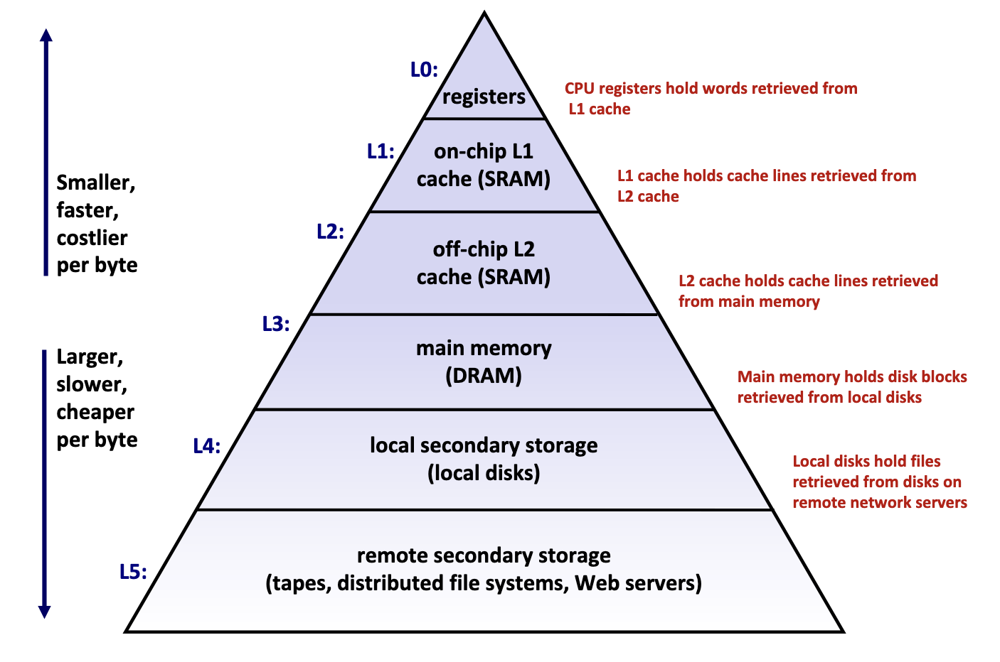
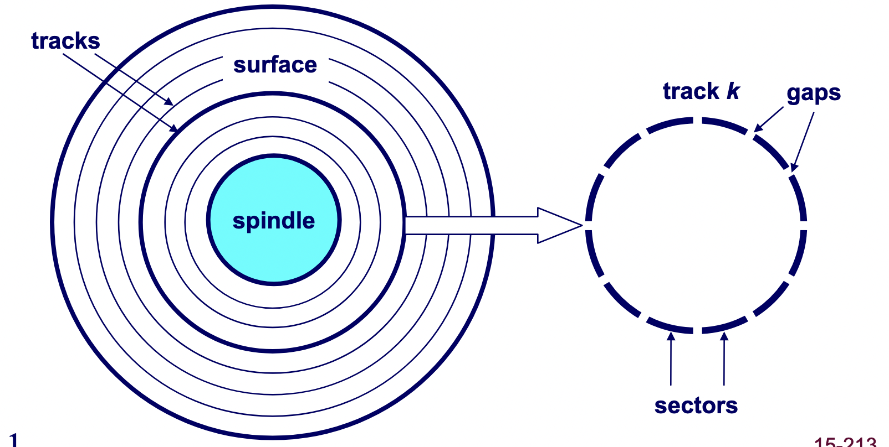
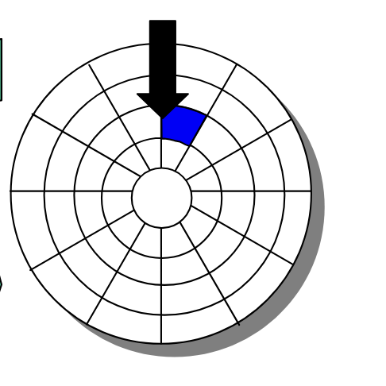
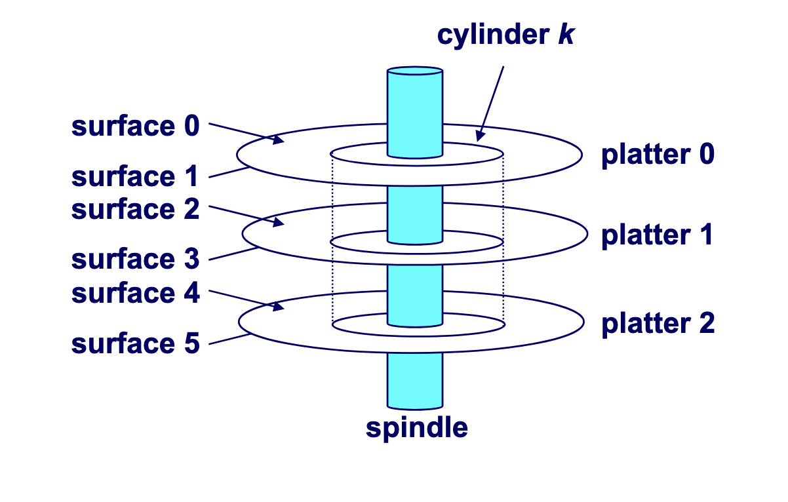
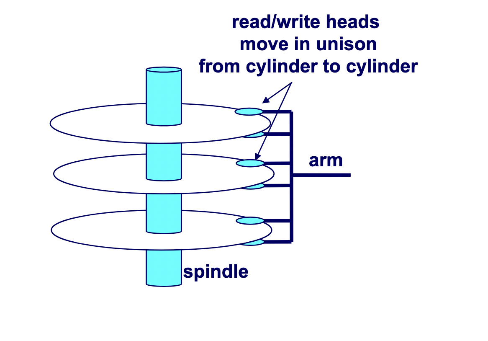
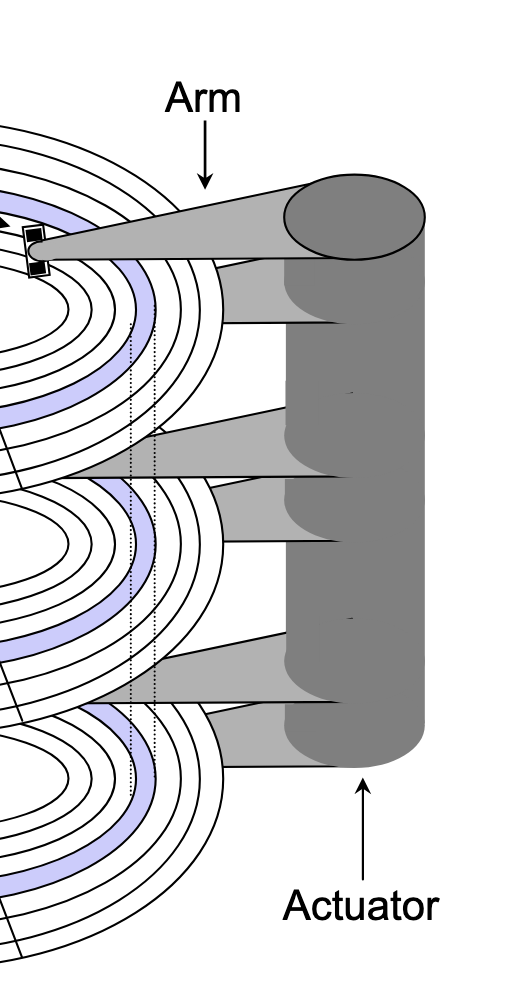
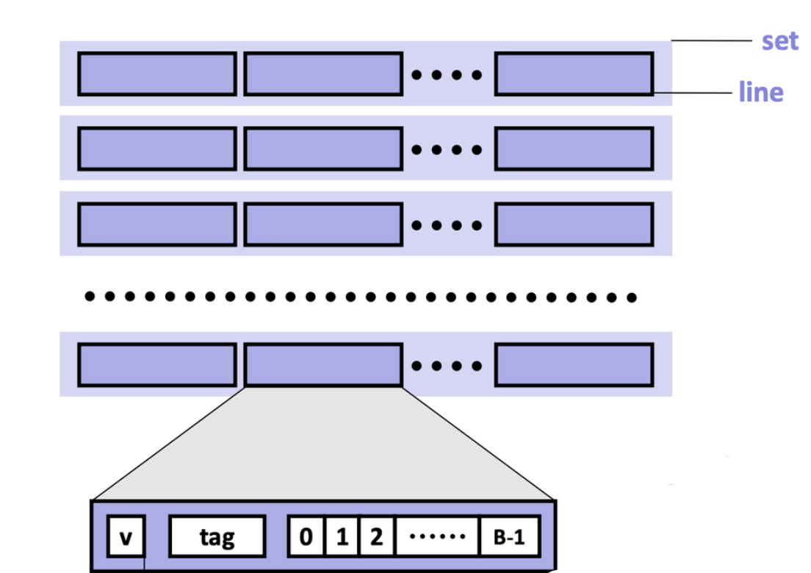
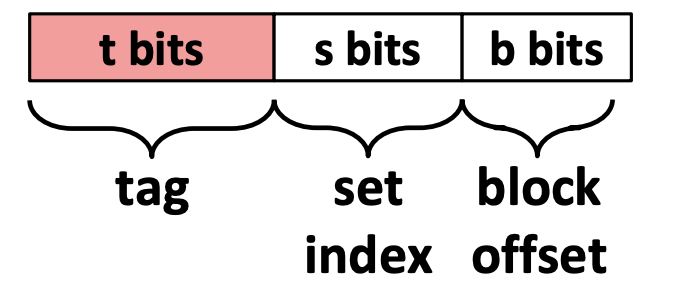
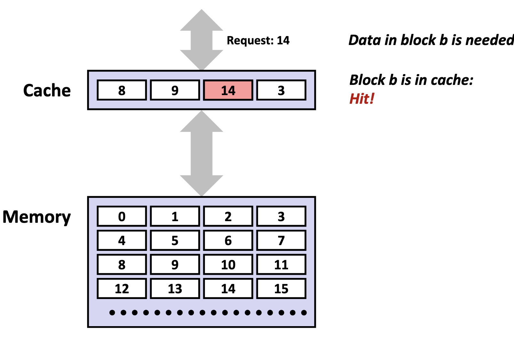

# Memory

## Memory Hierarchy

Memory hierarchy is typically divided into two broad categories:
- **Primary storage**: Devices the CPU can access directly using its instruction set, including registers, caches, and main memory. These devices are **volatile**, meaning they do _not_ retain data when power is lost.
- **Secondary storage**: Devices that the CPU cannot access directly, requiring data to first be copied into primary storage before the CPU can operate on it. These devices are **persistent** or **non-volatile**, meaning they retain data when there are power outages.

Performance is evaluated primarily along three dimensions:
- **Memory Latency**: the time required for a device to deliver requested data after being instructed to do so, measured in time units (nanoseconds, milliseconds) or CPU cycles
- **Memory Throughput**: the amount of data that can be transferred between the device and main memory per unit time, typically measured in bytes per second.
- **Memory Bandwidth**: The upper bound on the amount of data that can be read per unit time, typically measured in bytes per second.

These two metrics are influenced by two key factors:
- The distance from the CPU plays a crucial role, as devices closer to the CPU's processing units can deliver data more quickly.
- The underlying technology of the storage medium heavily influences performance. Registers and caches rely on extremely simple, compact circuits made of only a few logic gates, allowing signals to propagate almost instantly, while mechanical hard drives suffer from delays of 5-15 milliseconds due to the physical need to rotate and align read/write heads.

**Takeaway**: The faster the device, the smaller its storage capacity, and vice versa.

### Primary Storage

Primary storage devices, notably CPU registers, CPU caches, and main memory, consist of **random access memory (RAM)**, meaning the time required to access data remains constant regardless of the data's location within the device.

Primary storage devices follows two main cell memory designs: **Static RAM (SRAM)**, which stores data in small electrical circuits and represents the fastest type of memory used to build registers and caches, and **Dynamic RAM (DRAM)**, which stores data using capacitors that hold electrical charges and must frequently refresh these charges to maintain stored values, making it ideal for implementing main memory.

### Secondary Storage

The two most common secondary storage devices today are **hard disk drives** (HDDs) and flash-based **solid-state drives** (SSDs).

A hard drive consists of several flat, circular **platters**. Each platter has a upper surface and lower surface. Each surface is organized in concentric rings called **tracks**, and each track consists of **sectors** separated by **gaps**. Additionally, aligned tracks form a **cylinder**. In the centre of each platter, sits a **spindle**.

To read or write data, the mechanical **arms**, all attached to an **actuator**, where each arm with a **read/write head** at its tip, moves (i.e., extending or retracting) in unison across the platter to position the head over the cylinder containing the target sector (i.e., the sector holding the desired data). This step introduces a performance metric called **seek time**, where the typical average seek time is 3 to 5 ms. Then, the platters spins in counter-clockwise so that the target sector sits under the head. This step also introduces a performance metric called **rotational latency**, where the average rotational latency (in seconds) is found by $\frac{1}{2} \times \frac{1}{\text{RPM}} \times \frac{60 \text{ seconds}}{1 \text{ min}}$. Lastly, the data is read, where this step introduces a last performance metric called **transfer time**, calculated by $\frac{1}{\text{RPM}} \times \frac{1}{\text{average sectors per track}} \times \frac{60 \text{ seconds}}{1 \text{ min}}$

## Locality of Reference

**Locality of reference** refers to the memory access pattern of a program where programs tend to use instructions and data with addresses near or equal to those they have used recently. There are two forms of locality: **temporal locality**, which refers to the pattern where a program is likely to access recently referenced items again in the near future, while **spatial locality** refers to the pattern where a program tend to access data that is nearby (in terms of memory address) to previously accessed data.

## Caching

### Background

To understand why caches are important, we have to understand the processor-memory bottleneck problem. According to **Moore's law**, the number of transistors on microchips, and therefore processor performance, will double every two years. However, memory bus bandwidth improved much more slowly over the same period. This created a growing gap in improvement, where increasingly powerful processors were starved for data because they could request information faster than the memory system could deliver it. Caches are the solution which bridge this performance gap by.

A **cache** is computer memory with short access time built directly into your CPU used for storing copies of frequently or recently used instructions or data from main memory.

### Mechanics

#### Cache Addressing

Cache is made of small chunks of memory copied from main memory, where a single chunk is called a **cache line**, typically capable of each storing **64 bytes**. The cache can only load and store memory in multiples of a cache line (i.e., the data transfer unit is a cache line).

Each cache line consists of three sections: the **valid bit**, the **tag**, and the **data block**.

- **Valid bit**: Indicates whether the cache line contains valid, up-to-date data corresponding to some address in main memory.
- **Tag**: Stores the high-order bits of the memory address of the data currently cached.
- **Data block**: Contains the actual data copied from main memory.

> **Note**\
> For caches employing the write-back write hit policy, then it also contains a **dirtiness bit**. The dirtiness bit is $1$when the cache line is dirty, and $0$ when it's clean.

A cache memory address is split into three fields:
- **Block offset**: Tells _which_ starting byte inside a data block the CPU wants. The number of bits $b$ allocated to the block offset field is $\log_2 (B)$, where $B$ is the data block size.
- **Set index**: Tells _which set_ in the cache to look in. The number of bits $s$ allocated to the set index field is $\log_2 (S)$, where $S$ is the total sets.
- **Tag**: Tells _which_ specific data block the CPU wants to access in the cache. The number of bits $t$ allocated to the tag field is $w - (s + b)$, where $w$ is word size.

#### Accessing the Cache

1. **Locate the set**

    The cache uses the index bits from the memory address to identify which set in the cache might contain the desired block.

2. **Check for a matching tag**

    The cache compares the tag bits from the memory address with the stored tag in each cache line of that set. If a match is found, and the cache line's valid bit is set (i.e., the valid bit 1), we call this phenomenon a **cache hit**.

    

    If no match is found, or the valid bit is 0, we call this unsucecssful access a **cache miss**.

    There are three primary cases for a cache misses. A **cold (compulsory) miss** is a type of cache miss that happens when data is requested for the very first time, and therefore, is not yet present in the cache. A **capacity miss** is a type of cache miss that occurs when the cache is not large enough to hold all the data a program actively needs, called the **working set**, forcing existing data to be evicted to make room for new data. A **conflict miss** is a cache miss that occurs when a memory address maps to a cache location that is already occupied by a different cache line, despite the cache having free space elsewhere. The existing cache line is evicted and replaced with the cache line containing the requested memory address.

    When a cache miss occurs, the cache controller first looks for an invalid cache line to store the requested data. If all cache lines are valid (i.e., their valid bits are set to 1), one cache line must be replaced. In set-associative and fully associative caches, a **replacement policy** (such as LRU) determines which line to evict. In a direct-mapped cache, however, each memory block maps to exactly one line, so that line is automatically selected. After selecting the cache line to be replaced, if the cache is a write-back cache, and the cache line is dirty, the cache will write back to the lower memory device. Then, the cache controller fetches the requested data block from the next lower level of memory, stores it in the selected line, and updates the line’s valid bit and tag. Finally, the specific bytes requested by the CPU are extracted from the cache line and delivered to the processor.

5. **Perform the access (read or write)**

    On a read, the CPU retrieves the data directly from the cache line's data block, beginning at the **block offset** from the memory address. On a write, the CPU updates the cache line's data block, and may perform more actions depending on the cache write hit policy.

### Issues

Although caches are designed to accelerate performance by keeping frequently used data close to the CPU, inefficient access patterns can cause the opposite effect.

**Cache pollution** occurs when the cache is filled with data that is unlikely to be reused soon, displacing more valuable data that would have benefited from being cached. This often happens in workloads with poor temporal locality.

**Cache thrashing** is the phenomenon where different memory addresses repeatedly map to the same cache lines, causing constant evictions and reloads. Thrashing leads to a high miss rate and can degrade performance to the point where the cache provides little or no benefit.

### Cache Hierarchy

Modern processors organize caches into a three-tier hierarchy:
- **L1 cache**: the smallest and fastest cache, located directly on each CPU core for immediate access.
- **L2 cache**: larger and a bit slower than L1, usually dedicated to a single core but still very close to it.
- **L3 cache**: the largest and slowest of the three, typically shared among all cores on the processor to coordinate data efficiently.

| Level | Size          |
| ----- | ------------- |
| L1    | 32 KiB (each) |
| L2    | 256 KiB       |
| L3    | 8000 KiB      |

#### Instruction Cache and Data Cache

L1 caches are typically split into **instruction caches (I-cache)** and **data caches (D-cache)**, following the **Harvard Architecture** design principle.

The primary advantage of separating instruction and data caches is eliminating contention between instruction fetches and data accesses. A CPU typically needs to fetch instructions every cycle to keep the pipeline fed, while simultaneously loading and storing data for instructions already in execution. With a unified cache, instruction fetches and data accesses occurring in the same cycle would compete for the same **cache port** — the read/write access path into the cache's memory array. This competition creates a **structural hazard**, where multiple operations compete for the same hardware resource simultaneously, forcing the CPU to stall one operation until the resource becomes available. By splitting the L1 cache, instruction fetches and data accesses can occur simultaneously without interference. This parallelism keeps the pipeline busier and increases **instructions per cycle (IPC)**, directly improving processor performance.

Separate caches also provide valuable design flexibility. Instruction streams exhibit predictable characteristics: they follow mostly sequential access patterns, are highly predictable, and are rarely self-modifying. In contrast, data accesses are more random and frequently involve writes. This behavioral difference allows hardware designers to optimize each cache type:
- **I-cache optimization**: Can be designed as read-only with sequential access patterns, enabling aggressive prefetching of subsequent instruction lines while avoiding the complexity and cost of write-back circuits, cache invalidation logic, and coherency protocols.
- **D-cache optimization**: Must handle the full complexity of read/write operations, cache coherency, and the unpredictable access patterns typical of data operations.

### Cache Placement Policies

**Cache placement policies** are policies that determine where a particular memory address can be placed when it goes into a cache.

A **fully-associative cache** is a cache where a memory blocks are free to be stored anywhere in the cache. During each memory access, the system checks _every_ cache line for the data in parallel, but it still remains a fairly expensive operation for reasonably-sized caches.

To address this inefficiency, caches impose restrictions on where specific memory blocks can reside. However, it does bring along a tradeoff. Since the cache is dramatically smaller than main memory, multiple memory addresses must inevitably map to the same cache locations — a phenomenon called **cache aliasing**. When two aliased addresses are frequently accessed and modified, they compete for the same cache line, creating what's known as **cache line contention**.

A **set-associative cache** is a cache where a memory block maps to a specific **set** (i.e., a compartment of the cache), according to the index field encoded in the memory block's address. Each of the sets contains $N$ cache lines, where we typically specify a cache as **$N$-way set-associative**. The cache hardware uses the index field of the requested memory address to select a set of the cache, then within that set, it will search all $N$ cache lines in parallel.

A **direct-mapped cache** maps each memory block to exactly one specific cache line based on the index field encoded in the memory block's address. No searching is needed, as the hardware directly computes which single cache line to check.

As such, the total cache size (in bytes) is determined as follows:

$$
\text{cache size} = \text{total sets} \times \text{cache lines per set} \times \text{data block size}
$$

### Cache Write Policies

Cache reads do not involve upholding consistency with main memory. However, for cache writes, the CPU _must_ decide how to handle updates to the underlying main memory.

#### Write Hit Policies

- **Write-through**: The cache immediately propagates all writes to the lower memory whenever the cache has been written to, to ensure that memory across different volatile storage devices remain synchronized at all times.
- **Write-back**: The cache defers writes to the lower memory until absolutely necessary. Cache lines that have been modified but not yet written to the lower memory are considered **dirty**, where they'll need to eventually write its contents to lower memory (whether that's before an eviction, or an explicit flush).

#### Write Miss Policies

- **Write-allocate (fetch-on-write)**: The cache first loads the entire block from main memory into the cache, and then performs the write in the cache. This policy is typically paired with the write-back cache hit policy, because once the block is loaded, multiple writes can be performed locally without repeatedly accessing main memory.
- **No-write-allocate (write-around)**: The data is written directly to main memory, and the cache is not updated or allocated for that address. This policy is often paired with the write-through cache hit policy, since write-through already ensures main memory is always updated; combining it with write-allocate would unnecessarily duplicate work and waste time.
