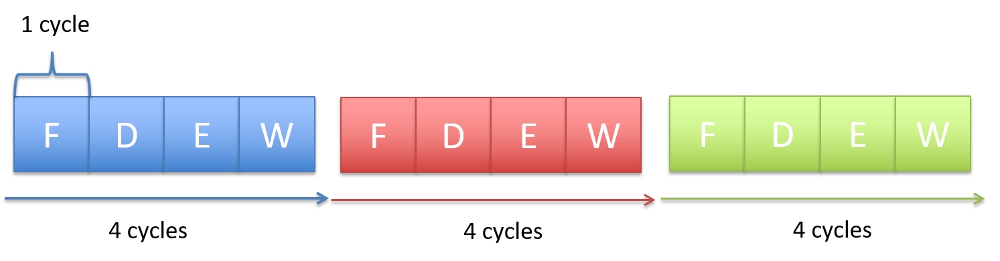
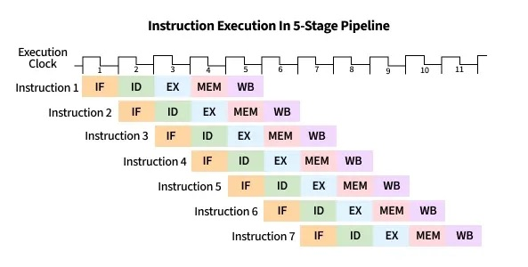
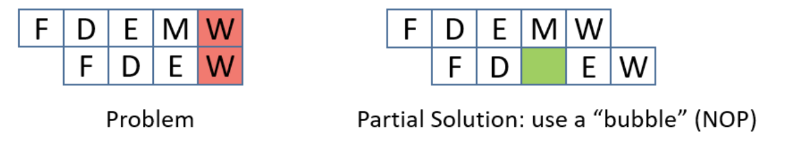
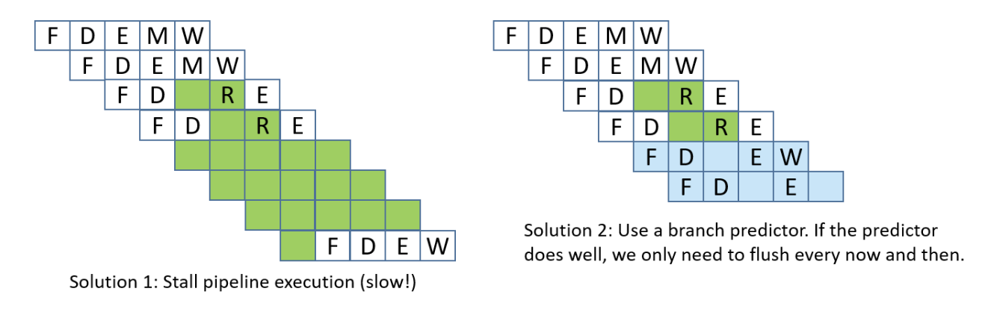

# Microarchitecture

## von Neumann architecture


### Control Processing Unit (CPU)

#### Processing Unit

The **processing unit (PU)** consists of three major subsections.

The first part is the **arithmetic/logic unit (ALU)**, which performs mathematical and logical operations on integers. It takes the data operands sitting in registers and performs the operation based on the opcode from the instruction. It then produces an integer result, as well as a **status flags**, which encodes information about the result of the operation just performed (e.g. whether the integer result is negative (negative flag), zero (zero flag), if there is a carry-out bit from the operation (carry flag), or if there is integer overflow (overflow flag), etc.). These status flags are sometimes used by subsequent instructions that choose an action based on a particular condition.

Similarly, the second part of the PU is the **floating-point unit (FPU)**, which performs arithmetic operations on floating-point values.

The fourth part of the PU is called the **register file**, which is the set of a small, fast unit of storage each called a **register**, used to hold program data and program instructions that are being executed by the ALU. These registers can each hold one data word.

#### Control Unit

The **control unit (CU)** drives the execution of program instructions by loading them from memory and feeding instruction operations and instruction operands through the processing unit. It also includes two special registers: the **program counter (PC)** keeps the memory address of the next instruction to execute, and the **instruction register (IR)** stores the instruction, loaded from memory, that is currently being executed.

Together, the control and processing units form the **control processing unit (CPU)**, which is the part of the computer that executes program instructions on program data.

#### Timing Circuit

The CPU also contains a **clock**, which is a hardware crystal oscillator that generates a **clock signal**, which is a continuous stream of electrical pulses that coordinates all processor activity. Each pulse, known as a **clock cycle**, acts like a heartbeat, synchronizing when the ALU performs an operation, when registers capture or update values, and when data is transferred across buses. Without the clock signal, the PU's components would have no reference for _when_ to act. The **clock speed** (or **clock rate**) is the frequency of these cycles, measured in hertz (typically gigahertz).

### Memory Unit

The **memory unit** stores both program instructions and program data, positioned close to the processing unit (PU) to reduce the time required for calculations. Its size varies depending on the system.

In modern computers, the memory unit is typically implemented as **random access memory (RAM)**. In RAM, every storage location (address) can be accessed directly in constant time. Conceptually, RAM can be viewed as an array of addresses. Since the smallest addressable unit is one byte, each address corresponds to a single byte of memory. The address space spans from $0$ up to $2^{\text{natural data width}} - 1$, where the natural data width depends on the ISA.

### Input and Output (I/O) Unit

The **input unit** consists of the set of devices that enable a user or program to get data from the outside world into the computer. The most common forms of input devices today are the keyboard and mouse. Cameras and microphones are other examples.

The **output unit** consists of the set of devices that relay results of computation from the computer back to the outside world or that store results outside internal memory. For example, the monitor and speakers are common output devices.

Some modern devices act both as an input and an output unit . For instance, touchscreen, act as both input and output, enabling users to both input and receive data from a single unified device. Solid-state drives and hard drives are another example of devices that act as both input and output devices, since they act as input devices when they store program executable files that the operating system loads into computer memory to run, and they act as output devices when they store files to which program results are written.

### Buses

The communication channel compromised of a set of wires which as a whole connects the units so that they may transfer information in binary to another unit is called the **bus**. Typically, architectures have separate buses for sending different types of information between units:

- the **data bus**: transferring data between units
- the **address bus**: sending the memory address of a read or write request to the memory unit
- the **control bus**: send control (i.e., read/write/clock) signals notifying the receiving units to perform some action.

An important bus is the one which connects the CPU and the memory unit together. On 64-bit architectures, the data bus is made of 64 parallel wires, and therefore capable of 8-byte data transfers, where each wire can send 1 bit of information.

## Instruction Set Architecture (ISA)

A particular CPU implements a specific **instruction set architecture (ISA)**, which defines the set of instructions and their binary encoding, the set of CPU registers, the natural data width of a CPU, and the effects of executing instructions on the state of the processor. There are many different ISAs, notably MIPS, ARM, x86 (including x86-32 and x86-64). A **microarchitecture** defines the circuitry of an implementation of a specific ISA. Microarchitecture implementations of the same ISA can differ as long as they implement the ISA definition. For example, Intel and AMD produce different microprocessor implementations of x86-64.

### Categories of ISAs

ISAs can be categorized based on two philosophies which describe how an ISA is structured and how instructions are meant to be implemented in hardware. These are the **reduced instruction set computer (RISC)**, and **complex instruction set computer (CISC)**.

Notable ISAs may be categorized as follows:
- CISC ISA: x86
- RISC ISAs: ARM, RISC-V, MIPS, IBM POWER

RISC ISAs have a small set of basic instructions that each execute within one clock cycle, and compilers combine sequences of several basic RISC instructions to implement higher-level functionality. It also supports simple addressing modes (i.e., ways to express the memory locations of program data), and fixed-length instructions.

In contrast, CISC ISAs have a large set of complex higher-level instructions that each execute in several cycles. It also supports more complicated addressing modes, and variable-length instructions.

### CPU Performance

The following equation is commonly used to express a computer's performance ability:

$$
\frac{\text{time}}{\text{program}}
= \frac{\text{instructions}}{\text{program}}
\times \frac{\text{cycles}}{\text{instruction}}
\times \frac{\text{time}}{\text{cycle}}
$$

CISC attempts to improve performance by minimizing the number of instructions per program (the first fraction), while RISC attempts to reduce the cycles per instruction (the second fraction), at the cost of the instructions per program.

Another way to measure performance is in terms of **Instructions Per Cycle (IPC)**, which represents the average number of instructions the CPU can complete in one clock cycle, where a higher IPC indicates better CPU utilization and parallelism.

## Instructions

### Types of Instructions

- Data Transfer Instructions
- Arithmetic and logic Operations
    - Arithmetic operations
    - Bitwise operations
    - Other math operations
- Control-flow instructions
    - Conditional and unconditional
    - Function calls and function returns

### Memory Layout

At a high level, instructions are typically made of bits which encode:
- **Opcode**: specifies the operation (e.g., `ADD`, `LOAD`, `STORE`, `BEQ`, etc.).
- **Operands**: indicate the data sources registers, immediates (constants encoded directly in the instruction), or memory addresses.
- **Destination**: indicates the destination register for storing the result of the operation

### Instruction Cycle

Every single instruction follows a **fetch-decode-execute cycle** , which usually takes around 4 CPU cycles. This process starts with a program's first instruction, and is repeated until the program exits.

#### Step 1: Fetch

- The CU retrieves the memory address stored in the PC, then places the address on the address bus and issues a read command over the control bus to request the instruction from memory.
- The MU reads the bytes at that address and transfers them back to the CU via the data bus.
- The CU stores these bytes in the IR.
- The CU increments the PC (typically by the size of the instruction), so it points to the next instruction in memory.

#### Step 2: Decode

- The CU interprets the instruction stored in the IR by decoding its bits according to the ISA's instruction format, which involves identifying the opcode and the operand fields.
- If the instruction requires operands, the CU retrieves their values—whether from CPU registers, memory, or directly embedded in the instruction—and prepares them as inputs for the processing unit.

#### Step 3: Execute

- The CU sends control signals to components in the PU to carry out the instruction.
- The instruction is executed, potentially involving arithmetic operations, data movement, or other actions.

#### Step 4: Memory

- For store instructions: The CU writes data to memory by placing the target address on the address bus, a write command on the control bus, and the data value on the data bus. The MU receives these signals and writes the value to the specified memory location.
- For load instructions: The CU places the source address on the address bus and a read command on the control bus. The MU responds by placing the requested data on the data bus.
- For other instructions: This stage may be skipped if no memory access is required.

#### Step 5: Write-back

- The CU updates the CPU's **register file** with the result of the executed instruction.
- If the instruction specified a destination register, the result is written back into that register, making it available for subsequent instructions.

> **Note**
> Not all instructions will need to go through all 5 stages.

## Instruction-Level Parallelism

### Pipelining

Notice that in the serial execution of the fetch-decode-execute cycle, the fetch hardware ends up being idle until the until the next instruction starts. This is wasteful! While instruction 1 is being decoded/executed/written back, the fetch unit could already be fetching instruction 2, 3, etc.



**CPU pipelining** is the idea of starting the execution of the next instruction before the current instruction has fully completed its execution. That is, pipelining will execute instructions in order, but it allows the execution of a sequence of instructions to overlap.

For example, in the first cycle, the first instruction enters the Fetch stage. In the second cycle, that instruction advances to Decode while the second instruction begins Fetch. In the third cycle, the first instruction reaches Execute, the second moves to Decode, and the third begins Fetch. In the fourth cycle, the first instruction enters the Memory stage, and the fourth instruction begins in the Fetch stage.

Finally, the first instruction enters in the write-back stage, and completes, where the second advances to the Memory stage, the third to Execute, and the fourth to Decode. At this point (i.e. after the fifth cycle), the pipeline is fully loaded, and so each stage of the CPU is busy with a different instruction, each one step behind the previous (which forms the staircase in the figure below). Once the pipeline is full, the CPU can complete one instruction every clock cycle, greatly improving instruction throughput. On the other hand, if each fetch-decode-execute cycle is performed sequentially, the instruction throughput would remain constant.



### Hazards

While pipelining improves instruction throughput by overlapping instruction stages, it can still suffer from
**hazards**: a situation that prevents the next instruction in the pipeline from executing in its designated clock cycle. This causes the pipeline to stop or delay instruction advancement, which we call a **pipeline stall**. There are three particular hazards: **data hazards**, **control hazards**, and **structural hazards**. A data hazard is a hazard caused when an instruction depends on the result of a previous one that has not yet completed. A common solution involves inserting **no operations (NOPs)** (also called a **pipeline bubbles**) into the pipeline, notably the shorter instruction.

Consider the following instruction stream:

```asm
mov rax, qword ptr [0x84]   ; Load memory at 0x84 into RAX
add rax, 2                  ; Add 2 to RAX
```

The `mov` instruction (`mov rax, qword ptr [0x84]`) needs to read from memory (MEM stage) and then write the result to `rax` (WB stage), which takes five pipeline stages. The `add` instruction (`add rax, 2`) only needs four stages since it doesn't go through the MEM stage. Because pipelining overlaps these stages, both instructions can be “in flight” at once — parts of both are being executed simultaneously.

However, since the `mov` instruction hasn't finished writing to `rax` yet (it hasn't reached its WB stage), the `add` instruction — which depends on the updated value in `rax` — reaches its EX stage early and tries to read `rax` before `mov`'s write-back is complete. This creates a **read-after-write (RAW)** hazard.

Also, since the `mov` takes five stages and the `add` takes four, their write-back stages line up so that both try to write to `rax` in the same cycle. This introduces another data hazard, a **write-after-write (WAW)** hazard.

To prevent this, the CPU can make all instructions effectively take five stages by inserting **no operations (NOPs, or informally, pipeline bubbles)**.

NOPs delay the `add` until the `mov` has fully completed, preventing overlapping writes. However, inserting bubbles slows down the pipeline, since extra cycles are wasted waiting for results.



A more efficient solution is **operand forwarding**. Instead of stalling with NOPs, the CPU can forward the result of the `mov` instruction directly from the pipeline stage where it becomes available to the stage where the `add` needs it. This allows the `add rax, 2` instruction to execute immediately once the loaded value is ready, without waiting for the `mov` to finish its write-back.

By using operand forwarding, the processor eliminates unnecessary bubbles, keeps the pipeline full, and executes both instructions efficiently.

A control hazard is a hazard when the pipeline doesn't know which instruction to fetch next because it's waiting for the outcome of a conditional branch instruction. This can cause the pipeline to make a wrong guess, requiring it to flush the incorrectly fetched instructions and restart, which slows down performance. To adress control hazards,many NOPs can be inserted by the compiler or assembler until the processor is sure that the branch is taken. Another solution involves **eager execution**, which execute both sides of the branch at the same time, and when the condition is finally known, it just chooses the right result. In x86, we see this through `cmov`. However, it brings some safety downsides, such as if one branch does something with side effects (like writing to memory or calling a function), you can't execute it speculatively without changing program behavior, or if one branch dereferences a pointer that might be invalid, executing it early could cause a crash, and of course, inefficiency, as it also wastes work when one path's results are thrown away. The most interesting solution is **branch prediction**, which involves a **branch predictor**, that predicts which way a branch will go, based on previous executions.



Lastly, structural hazards are hazards that arise when two instructions need the same hardware resource at the same time.

### Out-of-Order Execution

The CPU can be further optimized by allowing **out-of-order execution**. This means instructions that are independent of one another can be executed in a different order than they appear in the program, as long as the final results respect **program order**.

For example, consider this instruction stream:

1. `r3 = r1 * r2`
2. `r4 = r2 + r3`
3. `r7 = r5 * r6`
4. `r8 = r1 + r7`

There are two data hazards: instruction 2 depends on the result of instruction 1 (it needs the value of `r3`), and instruction 4 depends on the result of instruction 3 (it needs the value of `r7`). However, instructions 2 and 3 are independent of each other. Instead of stalling the pipeline while waiting for instruction 1 to finish, the CPU can begin executing instruction 3 in parallel, ensuring that hardware units stay busy.

