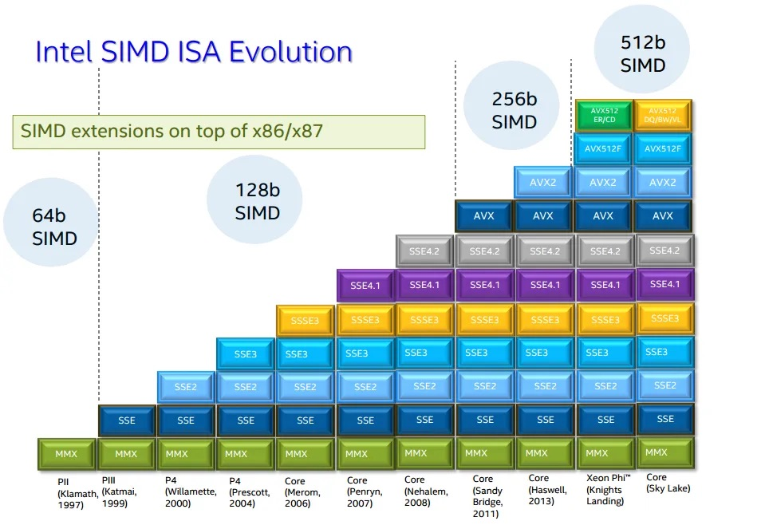

# SIMD

## Background

**Single Instruction, Multiple Data (SIMD)** is a form of data parallelism in which one instruction operates on multiple values simultaneously. This is achieved using **vector registers**, which hold multiple elements at once. Each slot within a vector register is called a **lane**, and operations on vector registers are called **vector operations**. On the other hand, **scalar operations** act on a single value at a time.


**SIMD instruction set extensions** provide additional support for vector operations using vector registers. The instruction set architecture defines which SIMD instruction set extensions are possible, but it is up to the specific processor implementation to decide which of those extensions to support, and which vector widths of the chosen SIMD extension it will implement.

| ISA     | SIMD Instruction Set Extension  | First-Class Native Vector Widths                           |
| ------- | ------------------------------- | ---------------------------------------------------------- |
| x86-64  | SSE, SSE2, SSE3, SSE4.1, SSE4.2 | 128 bits (fixed)                                           |
| x86-64  | AVX                             | 256 bits (fixed, float only)                               |
| x86-64  | AVX2                            | 256 bits (fixed, int + float)                              |
| x86-64  | AVX-512                         | 512 bits (fixed)                                           |
| AArch64 | NEON                            | 64 bits (fixed), 128 bits (fixed)                          |
| AArch64 | SVE                             | 128–2048 bits (scalable in 128-bit increments)             |
| AArch64 | SVE2                            | 128–2048 bits (scalable in 128-bit increments, more types) |



> **Note**\
> Each generation of x86-64 SIMD extensions builds upon the previous one. When using narrower vector operations from older instruction sets, they operate on the lower portion of the wider registers introduced in newer extensions.

> **Note**\
> To check what SIMD instruction set extensions your CPU supports, run `lscpu`, and look at the `Flags` output.

## Rust API

### Portable SIMD

[`std::simd` module](https://doc.rust-lang.org/std/simd/index.html)

> [!warning]
> Portable SIMD in Rust requires the Rust nightly compiler. To install it, run `rustup toolchain install nightly`, then temporarily set it to the default compiler via `rustup default nightly`

### Vendor SIMD Intrinsics

[`std::arch` module](https://doc.rust-lang.org/std/arch/index.html) and [Intel Intrinsics Guide](https://www.intel.com/content/www/us/en/docs/intrinsics-guide/index.html)

> **Note**\
> When writing non-portable SIMD code, consider using [Dynamic CPU Feature Detection](https://doc.rust-lang.org/std/arch/index.html#dynamic-cpu-feature-detection) since this approach allows:
> - The same binary to work on all CPUs
> - Automatic use of the fastest available instructions
> - Users don't need to worry about compatibility issues
>
> You can also use static CPU feature detection (via `RUSTFLAGS`), which bakes specific SIMD instruction set extensions into the entire binary, but is discouraged as this will crash on CPUs that don't support those features.

## Example

### Description

Given a slice of bytes `haystack` and a byte `needle`, find the first occurrence of `needle` in `haystack`.

### Solution

```rust
#![feature(portable_simd)]
use std::simd::cmp::SimdPartialEq;
use std::simd::u8x32;

pub fn find(haystack: &[u8], needle: u8) -> Option<usize> {
    const VECTOR_WIDTH: usize = 32;

    // For short strings (less than 16 bytes), use simple iteration instead of SIMD
    if haystack.len() < VECTOR_WIDTH {
        return haystack.iter().position(|&b| b == needle);
    }

    // Perform SIMD on strings of at least 32 bytes.
    //
    // For every 32-byte chunk of the haystack, we create two SIMD vectors: one for the 16-byte
    // chunk of the haystack we're working on, `haystack_vec`, and one 16-byte SIMD vector containing
    // 16-bytes of just `needle`, `needle_vec` such that we can compare each byte against the needle in parallel using `simd_eq`,
    // producing a mask.
    //
    // This SIMD mask is a vector of booleans, like:
    //   [false, false, false, true, false, ...]
    //
    // We convert this mask into a compact bitmask with `to_bitmask()`, which gives us
    // a u32 where each bit corresponds to an entry in the SIMD mask:
    //
    //   - A `true` in the SIMD mask becomes a `1` in the bitmask.
    //   - A `false` becomes a `0`.
    //
    // Importantly: the first element of the mask (index 0) maps to the least significant bit (bit 0)
    // in the bitmask, mask[1] maps to bit 1, and so on. This means `bitmask.trailing_zeros()`
    // directly gives us the index of the first `true` in the mask.
    //
    // So if the bitmask is, say, 0b00001000, then the first match was at index 3.
    //
    // Using `bitmask.trailing_zeros()` gives us the index of the first `true` in the mask.
    // We then add the chunk offset to get the actual index in the full haystack.
    let needle_vec = u8x32::splat(needle);

    let mut offset = 0;
    while offset + VECTOR_WIDTH <= haystack.len() {
        let chunk = &haystack[offset..offset + VECTOR_WIDTH];
        let haystack_vec = u8x32::from_slice(chunk);
        let mask = haystack_vec.simd_eq(needle_vec);
        let bitmask = mask.to_bitmask();

        if bitmask != 0 {
            return Some(offset + bitmask.trailing_zeros() as usize);
        }
        offset += VECTOR_WIDTH;
    }

    // Handle remaining bytes (less than 32) that couldn't be processed with SIMD
    haystack[offset..]
        .iter()
        .position(|&b| b == needle)
        .map(|pos| offset + pos)
}
```
